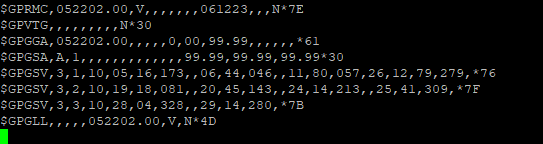

# GPS for FormUla 1
The gps functionality is provided by a [GT-U7 chip](https://images-na.ssl-images-amazon.com/images/I/91tuvtrO2jL.pdf). The breakout board has 5 pins
|Pin|Description|
|----|------|
|VCC| Power pin, 5V|
|GND| Ground pin|
|TXD| Transmit pin, Output, 3.3V|
|RXD| Receive pin, Input, ***3.3V tolerant***|
|PPS| Pulse per second, Output, 3.3V|

On the STM32 Disco board, UART1 has a TX on pin PB6 and RX on pin PB7. This is the UART used to view printk messages. UART3 has a TX on pin PC4 and an RX on pin PC5, which will be used for GPS Uart

Here's a sample of the GPS output over the USB UART connection:

