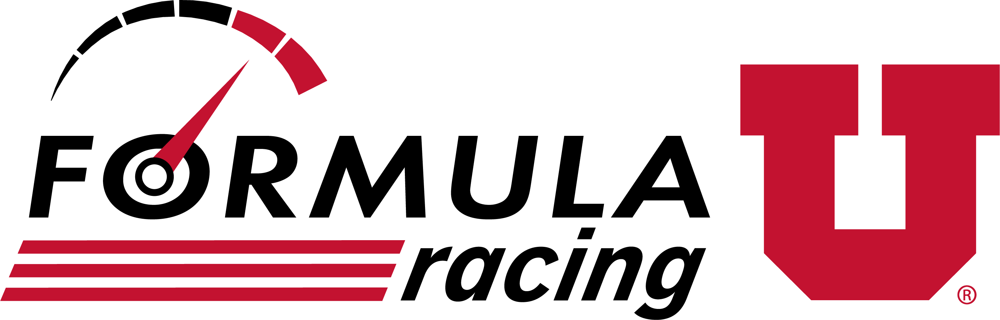

<!-- Improved compatibility of back to top link: See: https://github.com/othneildrew/Best-README-Template/pull/73 -->
<a name="readme-top"></a>
<!--
*** Thanks for checking out the Best-README-Template. If you have a suggestion
*** that would make this better, please fork the repo and create a pull request
*** or simply open an issue with the tag "enhancement".
*** Don't forget to give the project a star!
*** Thanks again! Now go create something AMAZING! :D
-->

<!--  -->

<!-- PROJECT SHIELDS -->
<!--
*** I'm using markdown "reference style" links for readability.
*** Reference links are enclosed in brackets [ ] instead of parentheses ( ).
*** See the bottom of this document for the declaration of the reference variables
*** for contributors-url, forks-url, etc. This is an optional, concise syntax you may use.
*** https://www.markdownguide.org/basic-syntax/#reference-style-links
-->
[![Contributors][contributors-shield]][contributors-url]
[![Issues][issues-shield]][issues-url]
[![MIT License][license-shield]][license-url]


<!-- PROJECT LOGO -->
<br />
<div align="center">
  <a href="https://github.com/uofu-emb/FormulaU23.git">
    
  </a>

<h3 align="center">Formula U Electric Vehicle Embedded Systems</h3>

  <p align="center">
    This project involves developing the embedded systems and telemetry interfaces for the Formula University electric race vehicle.
    <br />
    <a href="https://github.com/uofu-emb/FormulaU23"><strong>Explore the docs »</strong></a>
    <br />
    <br />
    <a href="https://github.com/uofu-emb/FormulaU23">View Demo</a>
    ·
    <a href="https://github.com/uofu-emb/FormulaU23/issues">Report Bug</a>
    ·
    <a href="https://github.com/uofu-emb/FormulaU23/issues">Request Feature</a>
  </p>
</div>


<!-- TABLE OF CONTENTS -->
<details>
  <summary>Table of Contents</summary>
  <ol>
    <li>
      <a href="#about-the-project">About The Project</a>
      <ul>
        <li><a href="#built-with">Built With</a></li>
      </ul>
    </li>
    <li>
      <a href="#about-the-project">Sensor Interfacingt</a>
    </li>
    <li>
      <a href="#about-the-project">Data Monitoring & Logging</a>
    </li>
    <li>
      <a href="#about-the-project">Dashboard Interface</a>
    </li>
    <li>
      <a href="#about-the-project">Communication Protocols</a>
      <ul>
        <li><a href="#prerequisites">CAN</a></li>
        <li><a href="#installation">I2C</a></li>
      </ul>
    </li>
    <li>
      <a href="#getting-started">Getting Started</a>
      <ul>
        <li><a href="#prerequisites">Prerequisites</a></li>
        <li><a href="#installation">Installation</a></li>
      </ul>
    </li>
    <li><a href="#usage">Usage</a></li>
    <li><a href="#roadmap">Roadmap</a></li>
    <li><a href="#contributing">Contributing</a></li>
    <li><a href="#license">License</a></li>
    <li><a href="#contact">Contact</a></li>
    <li><a href="#acknowledgments">Acknowledgments</a></li>
  </ol>
</details>


<!-- ABOUT THE PROJECT -->
## About The Project

This project involves developing the embedded systems and telemetry interfaces for the Formula University electric race vehicle. Key aspects include:
<p align="right">(<a href="#readme-top">back to top</a>)</p>


### Built With

* [![cpp][cpp-shield]][cpp-url]


<p align="right">(<a href="#readme-top">back to top</a>)</p>


<!-- SENSOR -->
## Sensor Interfacingt

Interfacing with and capturing data from various sensors and vehicle systems:

* Accelerator and brake pedal position sensors
* Battery management and motor control systems
* Inertial monitoring unit (IMU)
* Wheel speed sensors
* Steering angle sensor
* Suspension position sensors
* Tire pressure/temperature sensors
* Brake temperature sensors

<!-- DATA LOGGING -->
## Data Monitoring & Logging

* Streaming key vehicle telemetry parameters remotely to paddock
* Storing sensor data logs for post-run analysis
* Logging trouble/error codes for diagnostics

<!-- DASHBOARD -->
## Dashboard interface

* Developing digital dashboard display to provide real-time systems status feedback to driver

<!-- COMMUNICATION PROTOCOLS -->
## Communication Protocols
Implementing communication protocols to share data between components

### CAN


### I2C


<!-- GETTING STARTED -->
## Getting Started

Clone this Repo

### Prerequisites

Using platformio run the following command
* pio
  ```sh
  pio project init --board disco_f072rb --project-option "framework=zephyr"
  ```


<p align="right">(<a href="#readme-top">back to top</a>)</p>


<!-- USAGE EXAMPLES 
## Usage

Use this space to show useful examples of how a project can be used. Additional screenshots, code examples and demos work well in this space. You may also link to more resources.

_For more examples, please refer to the [Documentation](https://example.com)_

<p align="right">(<a href="#readme-top">back to top</a>)</p> -->


<!-- ROADMAP -->
## Roadmap


<p align="right">(<a href="#readme-top">back to top</a>)</p>


<!-- CONTRIBUTING -->
## Contributing

Contributions are what make the open source community such an amazing place to learn, inspire, and create. Any contributions you make are **greatly appreciated**.

If you have a suggestion that would make this better, please fork the repo and create a pull request. You can also simply open an issue with the tag "enhancement".
Don't forget to give the project a star! Thanks again!

<p align="right">(<a href="#readme-top">back to top</a>)</p>


<!-- LICENSE -->
## License

Distributed under the "" License. See `LICENSE.txt` for more information.

<p align="right">(<a href="#readme-top">back to top</a>)</p>


<!-- CONTACT -->
## Contact


<p align="right">(<a href="#readme-top">back to top</a>)</p>

<!-- ACKNOWLEDGMENTS -->
## Acknowledgments

* []()
* []()
* []()

<p align="right">(<a href="#readme-top">back to top</a>)</p>


<!-- MARKDOWN LINKS & IMAGES -->
<!-- https://www.markdownguide.org/basic-syntax/#reference-style-links -->
[contributors-shield]: https://img.shields.io/github/contributors/ctapiero/Lab6.svg?style=for-the-badge
[contributors-url]: https://github.com/ctapiero/Lab6/graphs/contributors
[forks-shield]: https://img.shields.io/github/forks/ctapiero/Lab6.svg?style=for-the-badge
[forks-url]: https://github.com/ctapiero/Lab6/network/members
[stars-shield]: https://img.shields.io/github/stars/ctapiero/Lab6.svg?style=for-the-badge
[stars-url]: https://github.com/ctapiero/Lab6/stargazers
[issues-shield]: https://img.shields.io/github/issues/ctapiero/Lab6.svg?style=for-the-badge
[issues-url]: https://github.com/ctapiero/Lab6/issues
[license-shield]: https://img.shields.io/github/license/ctapiero/Lab6.svg?style=for-the-badge
[license-url]: https://github.com/ctapiero/Lab6/blob/master/LICENSE.txt
[linkedin-shield]: https://img.shields.io/badge/-LinkedIn-black.svg?style=for-the-badge&logo=linkedin&colorB=555
[linkedin-url]: https://linkedin.com/in/linkedin_username
[product-screenshot]: images/screenshot.png
[cpp-shield]: https://img.shields.io/badge/-c++-black?logo=c%2B%2B&style=social
[cpp-url]: https://cplusplus.com/
[React.js]: https://img.shields.io/badge/React-20232A?style=for-the-badge&logo=react&logoColor=61DAFB
[React-url]: https://reactjs.org/
[Vue.js]: https://img.shields.io/badge/Vue.js-35495E?style=for-the-badge&logo=vuedotjs&logoColor=4FC08D
[Vue-url]: https://vuejs.org/
[Angular.io]: https://img.shields.io/badge/Angular-DD0031?style=for-the-badge&logo=angular&logoColor=white
[Angular-url]: https://angular.io/
[Svelte.dev]: https://img.shields.io/badge/Svelte-4A4A55?style=for-the-badge&logo=svelte&logoColor=FF3E00
[Svelte-url]: https://svelte.dev/
[Laravel.com]: https://img.shields.io/badge/Laravel-FF2D20?style=for-the-badge&logo=laravel&logoColor=white
[Laravel-url]: https://laravel.com
[Bootstrap.com]: https://img.shields.io/badge/Bootstrap-563D7C?style=for-the-badge&logo=bootstrap&logoColor=white
[Bootstrap-url]: https://getbootstrap.com
[JQuery.com]: https://img.shields.io/badge/jQuery-0769AD?style=for-the-badge&logo=jquery&logoColor=white
[JQuery-url]: https://jquery.com 

